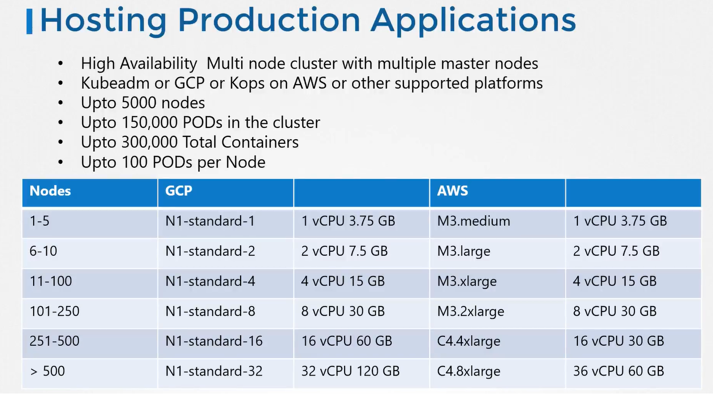
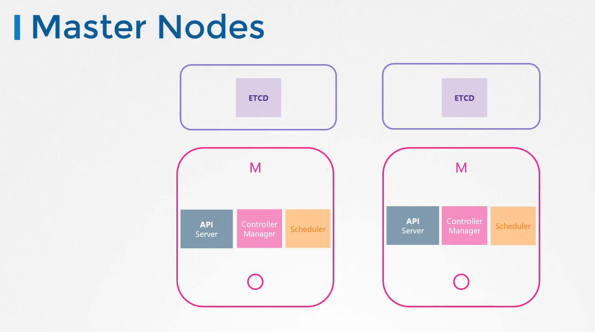

# Designing a Kubernetes Cluster

  Take me to [Video Tutorial](https://kodekloud.com/courses/539883/lectures/9817006)
  
In this section, we will take a look at designing a kubernetes cluster

#### Ask yourself before you provision a cluster
- Purpose 
- Cloud or OnPrem
- Workloads

#### Hosting Production Applications

 
 
#### Master Nodes
  
 
 
 
