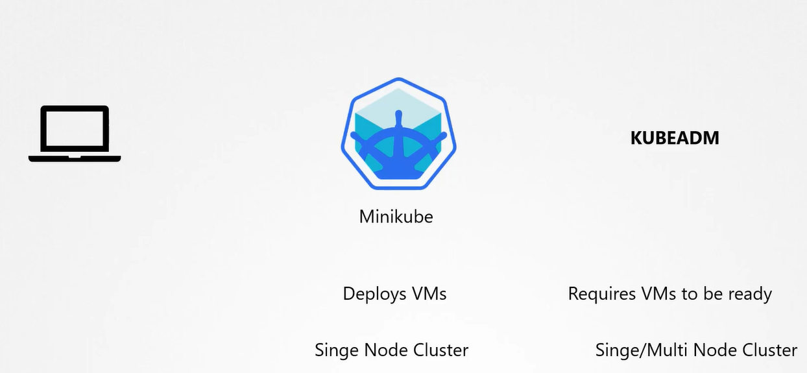
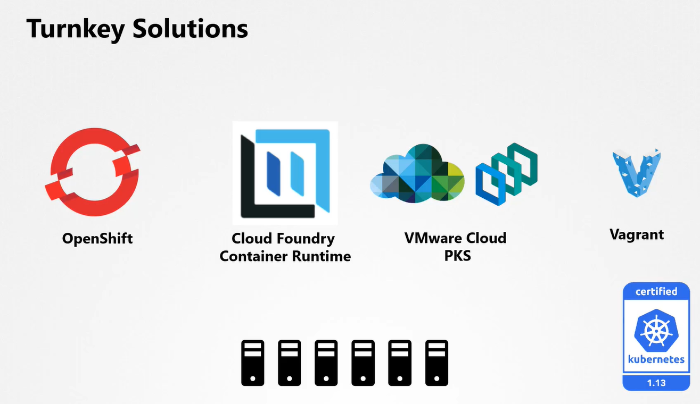
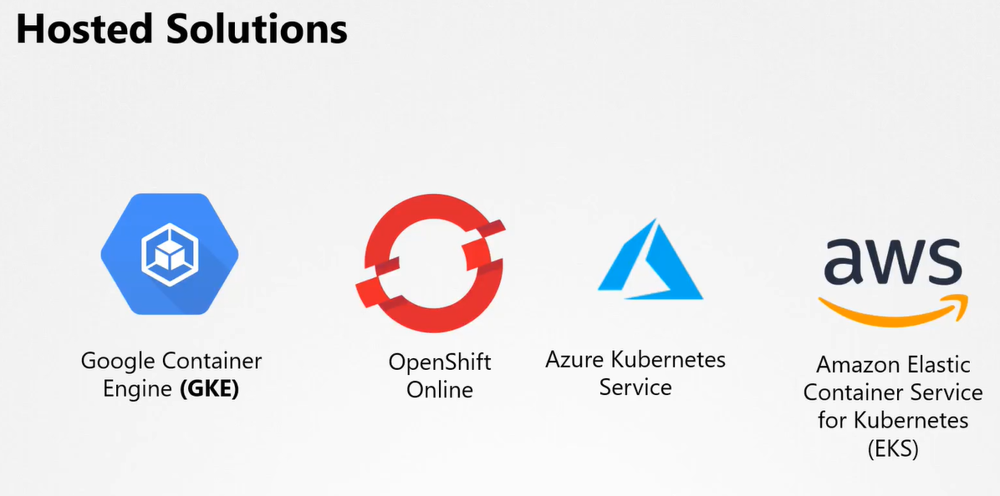
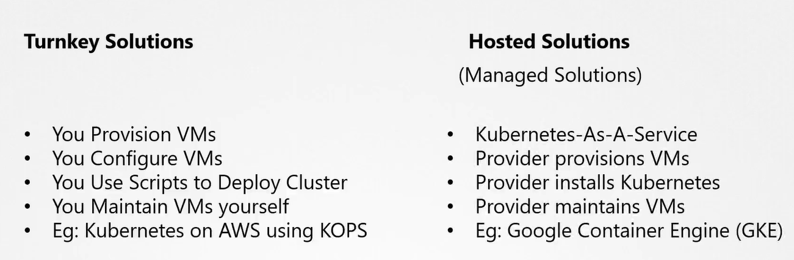
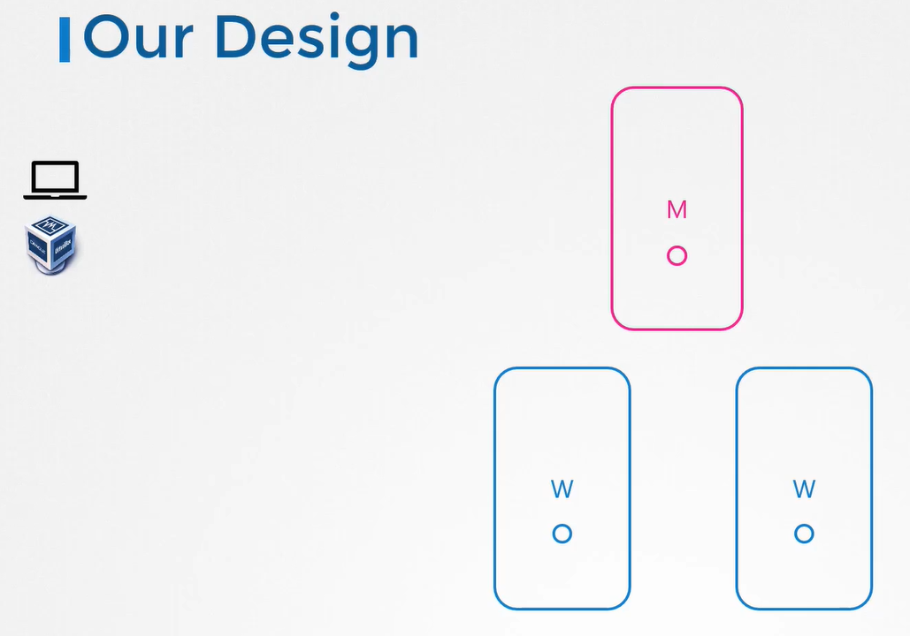

# Choosing a Kubernetes Infratructure

  Take me to [Lecture](https://kodekloud.com/courses/539883/lectures/9808342)
  
#### Kubernetes can be deployed on various systems in different ways.
- What are some of the solutions available to easily get started with kubernetes on a local machine?
  - Minikube
  - Kubeadm
  
- Deploying a kubernetes cluster locally on a laptop is usually for learning, testing and development purposes

  

- For Production purposes there are many ways to get started with kubernetes cluster. Both in a private or a public cloud environment.
  - Turnkey Solutions
    
    
    
  - Hosted Solutions
  
    

  

#### Our Lab Design

  
  
 
#### K8s Doc for reference
- https://kubernetes.io/docs/setup/

  

    
