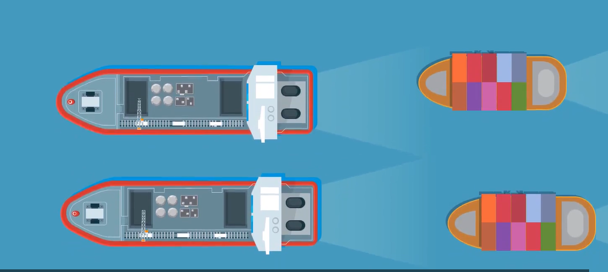
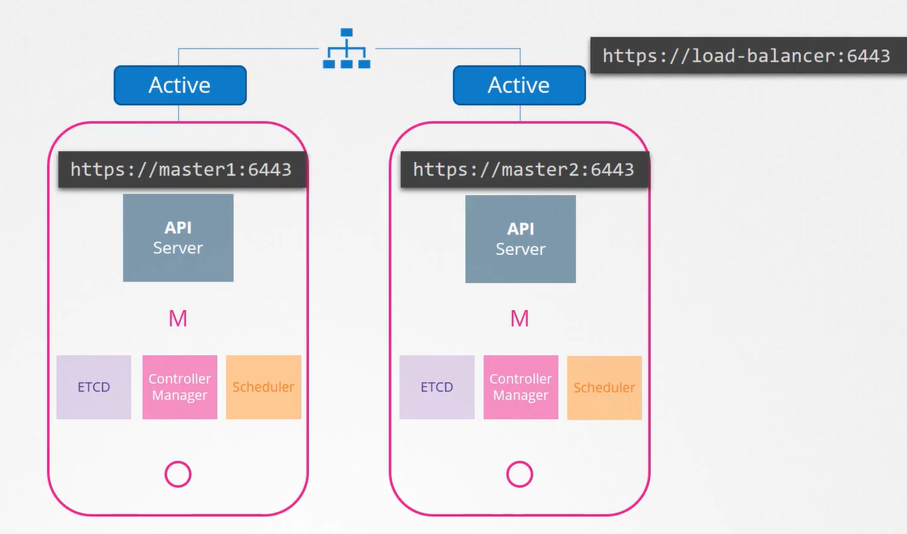
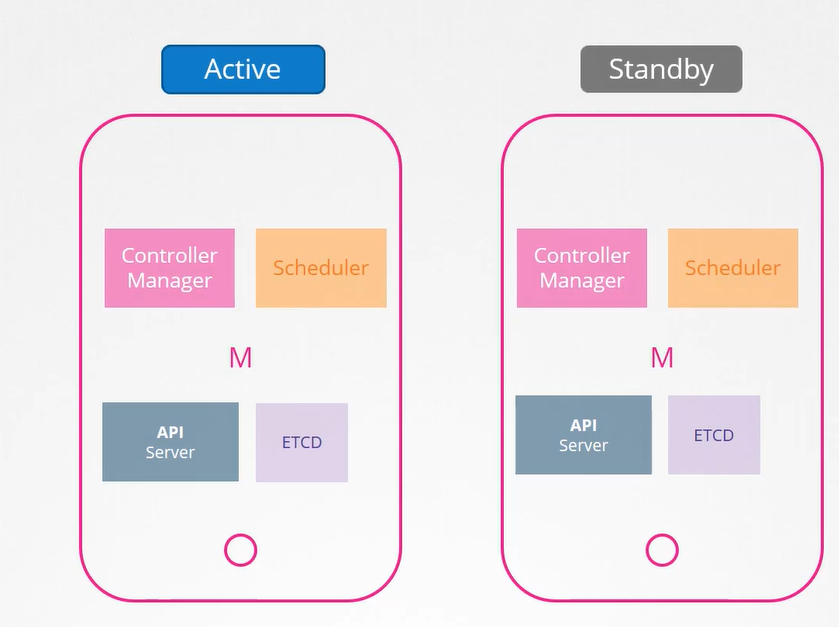
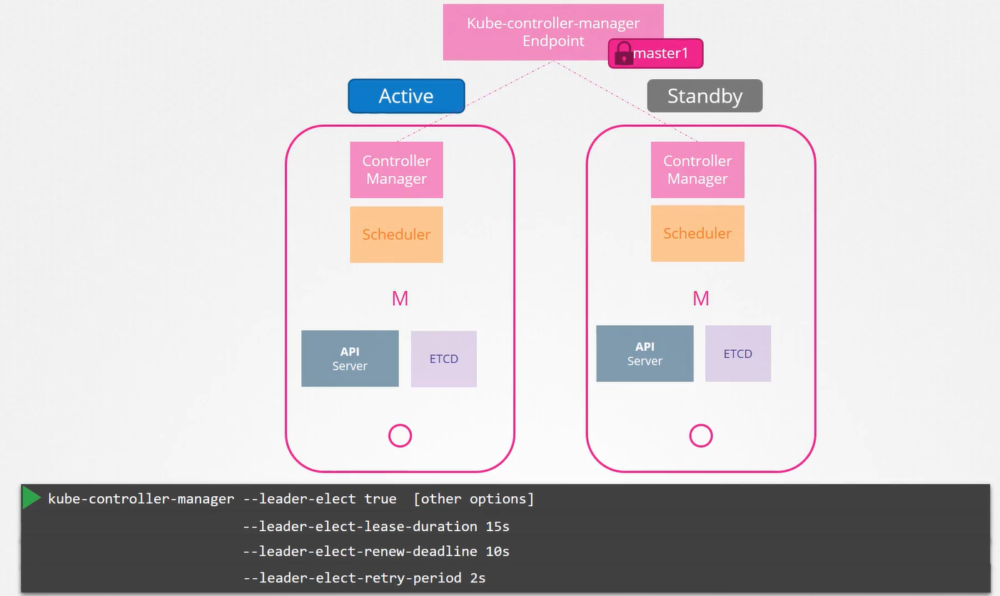
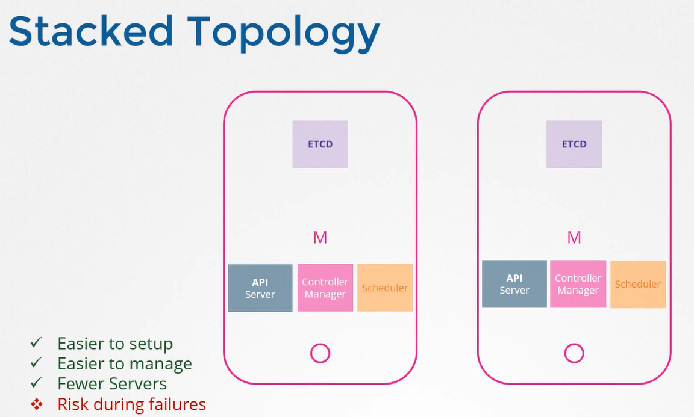
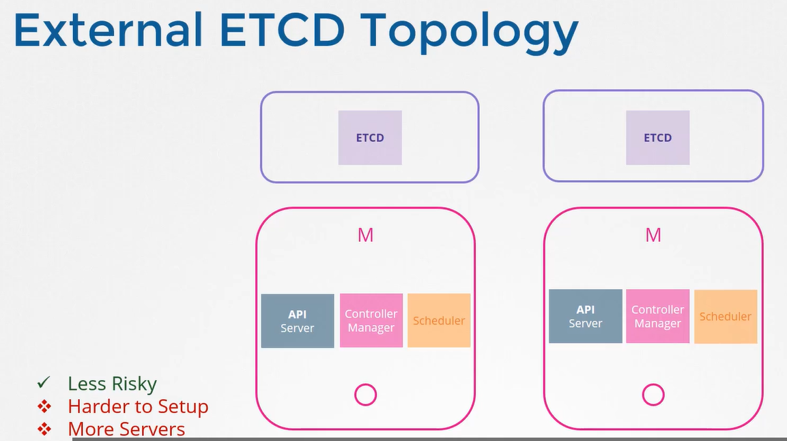
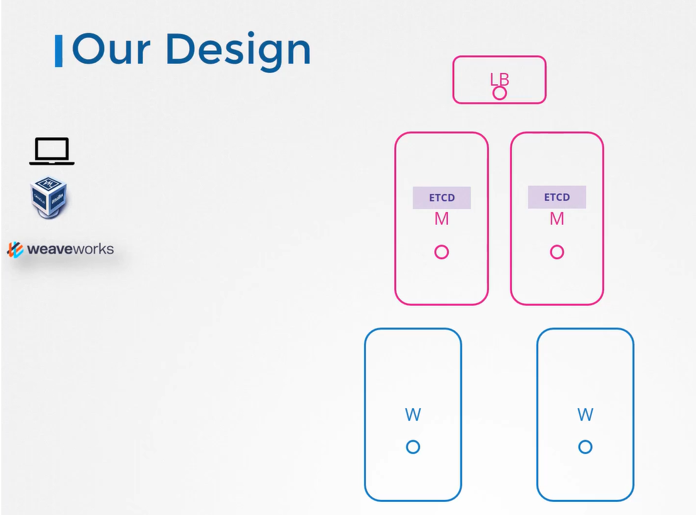

# Choosing a HA

  Take me to [Lecture](https://kodekloud.com/courses/539883/lectures/9808328)
  
#### What happens when you loose the master node in your cluster?
- You must consider multiple master nodes in a a high availability environment configuration in your prod environment.
  
  
  
- It is better to have a load balancer of some kind configured infront of the master nodes that split traffic between the API servers. And then point kubectl utility to that load balancer 

  
  
- What about the scheduler and the controller manager?

  
 
  
 
- what about the etcd? With etcd we have two topologies that we can configure in kubernetes.
  - Stacked Topology
  
    

  - External ETCD Topology
    

#### Our Lab Design

 

   
#### K8s Reference Docs
- https://kubernetes.io/docs/setup/production-environment/tools/kubeadm/high-availability/
- https://kubernetes.io/docs/tasks/administer-cluster/highly-available-master/

  
