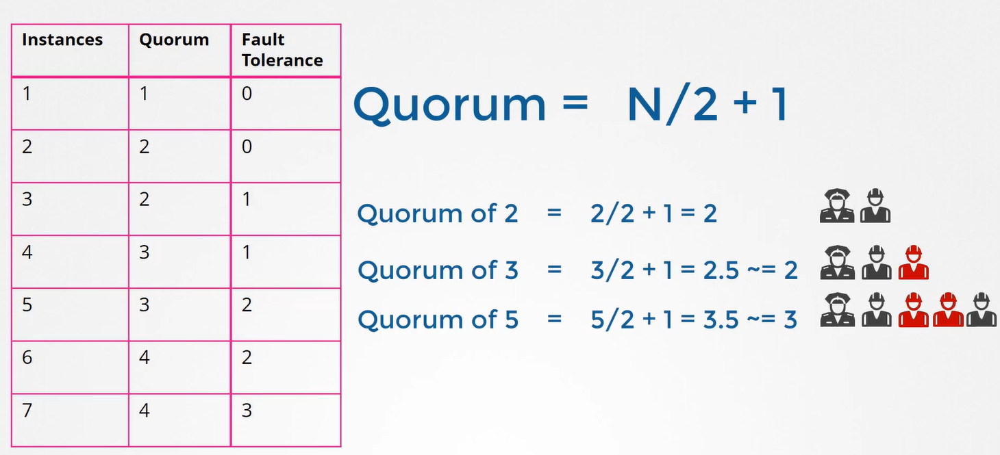
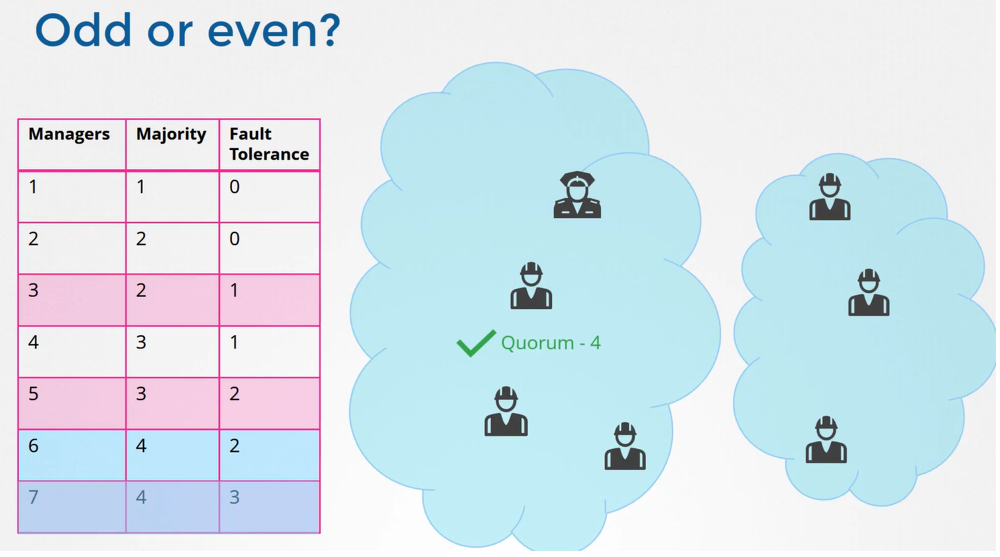
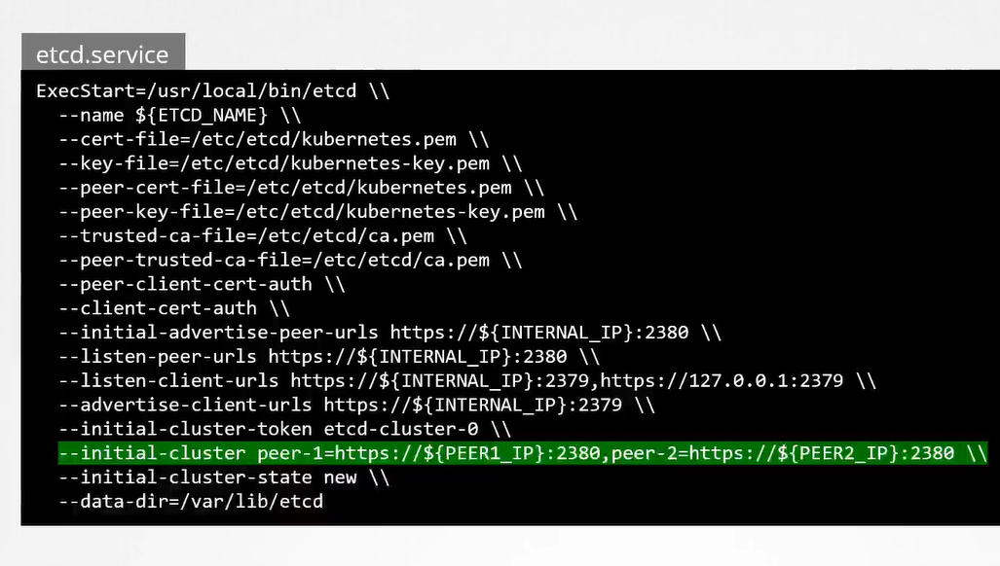
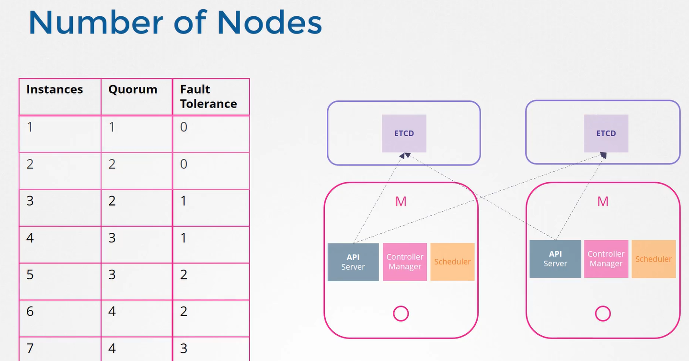
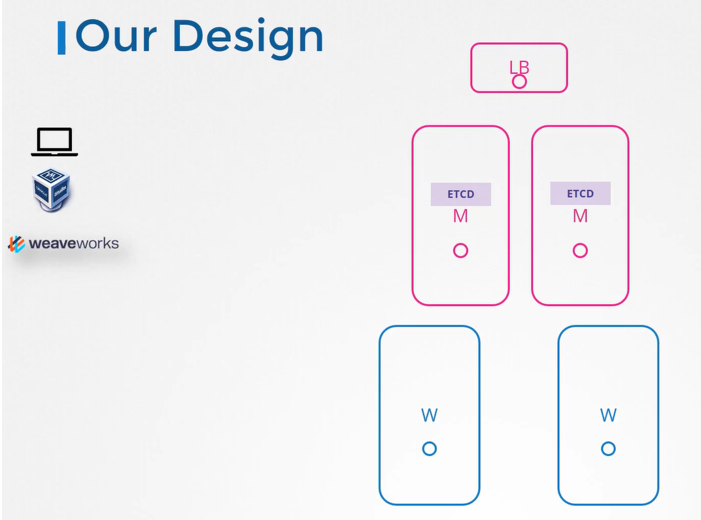

# ETCD in HA

  Take me to [Lecture](https://kodekloud.com/courses/539883/lectures/9808331)
  
In this section, we will discuss about ETCD in HA mode 

#### Objectives
- What is ETCD?
- What is a key-value store?
- How to get started quickly?
- How to operate ETCD?
- What is distributed system?
- How ETCD operates?
- RAFT Protocol
- Best Practices on number of nodes

#### Quorum
- Quorum is the minimum number of nodes that must be available for the cluster to function properly or make a successful right in case of 3, we know its 2. 
- For any given number of nodes, the quorum is the total number of nodes divided by 2 + 1.

  
  
  
  
#### Getting Started
- Download the binary
  ```
  $ wget -q --http-only https://github.com/coreos/etcd/releases/download/v3.3.9/etcd-v3.3.9-linux-amd64.tar.gz
  ```
- Extract it
  ```
  $ tar -xvzf etcd-v3.3.9-linux-amd64.tar.gz
  ```
- Move the etcd binaries to /usr/local/bin/
  ```
  $ mv etcd-v3.3.9-linux-amd64/etcd* /usr/local/bin/
  ```
- Create directories
  ```
  $ mkdir -p /etc/etcd /var/lib/etcd
  ```
- Copy TLS certs
  ```
  $ cp ca.pem kubernetes-key.pem kubernetes.pem /etc/etcd/
  ```
  
#### Configure the etcd service

  
  
#### ETCDCTL
- The etcdctl utility has 2 versions
  - V2 
  - V3
  
- Set etcdctl_api environment variable to 3
  ```
  $ export ETCDCTL_API=3
  ```

#### Number of Nodes

  
  
#### Our Lab Design

  

#### K8s Reference Docs
- https://github.com/etcd-io/etcd/releases
  
  
