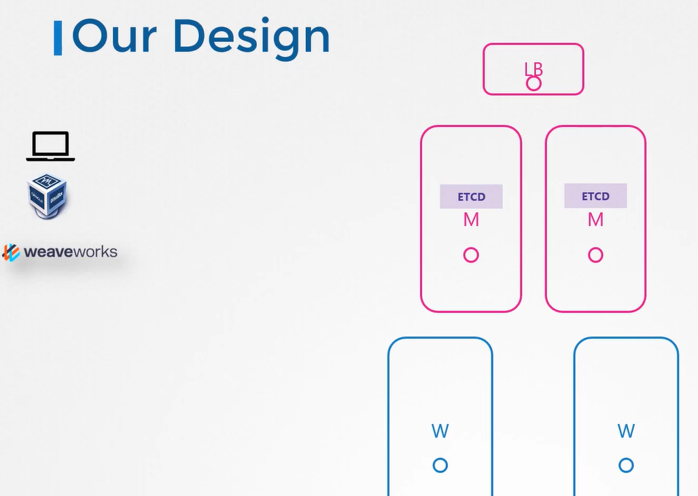
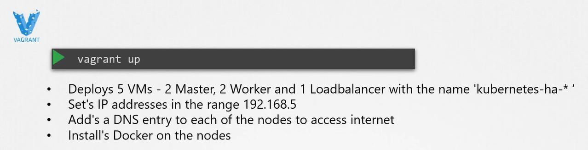
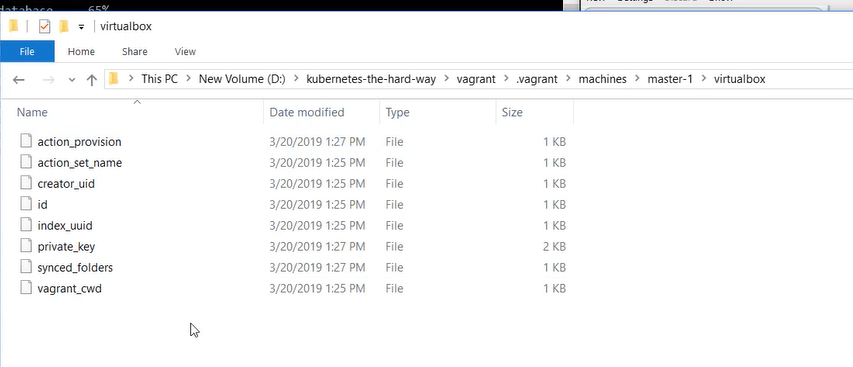
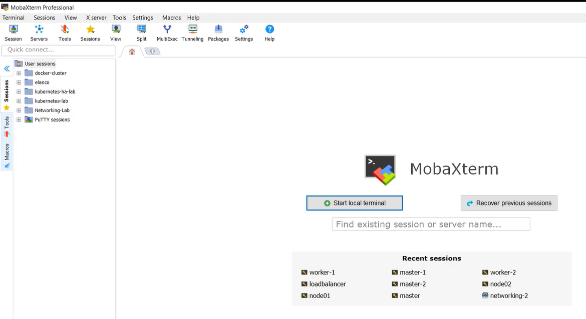

# Provisioning VM's

  Take me to [Lecture](https://kodekloud.com/courses/539883/lectures/9808334)
  
#### Our Lab Design

  
  
#### Vagrant
- We will be using vagrant, we have a vagrant file which will deploy the setup with a single command
  ```
  $ vagrant up
  ```
  
  
  
#### Demo Provisioning Infrastructure

- https://github.com/mmumshad/kubernetes-the-hard-way/blob/master/docs/02-compute-resources.md

  

- We will use the private key to ssh in to the VMs

  
 
- To ssh into the node with vagrant
  ```
  $ vagrant ssh master-1
  ```
- Alternatively you can use any of our favourate terminals like mobaxterm

  
  
  

  
