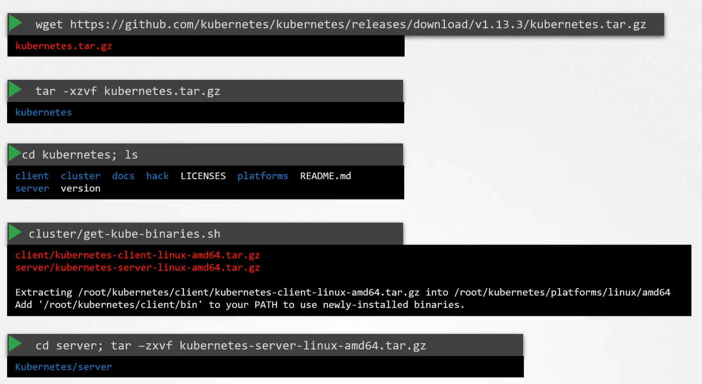

# Kubernetes Release Binaries

  Take me to [Lecture](https://kodekloud.com/courses/539883/lectures/9808329)
  
#### Kubernetes Github Release page
- https://github.com/kubernetes/kubernetes/releases

Download the latest release to your system
```
$ wget https://github.com/kubernetes/kubernetes/releases/download/v1.19.0/kubernetes.tar.gz
```

Extract it
```
$ tar -xvzf kubernetes.tar.gz
```

Change to the directory and view the files
```
$ cd kubernetes
$ ls
```

Download the kubectl client and server binaries by running the below commands
```
$ cluster/get-kube-binaries.sh
```




#### K8s reference docs
- https://kubernetes.io/docs/setup/release/notes/
